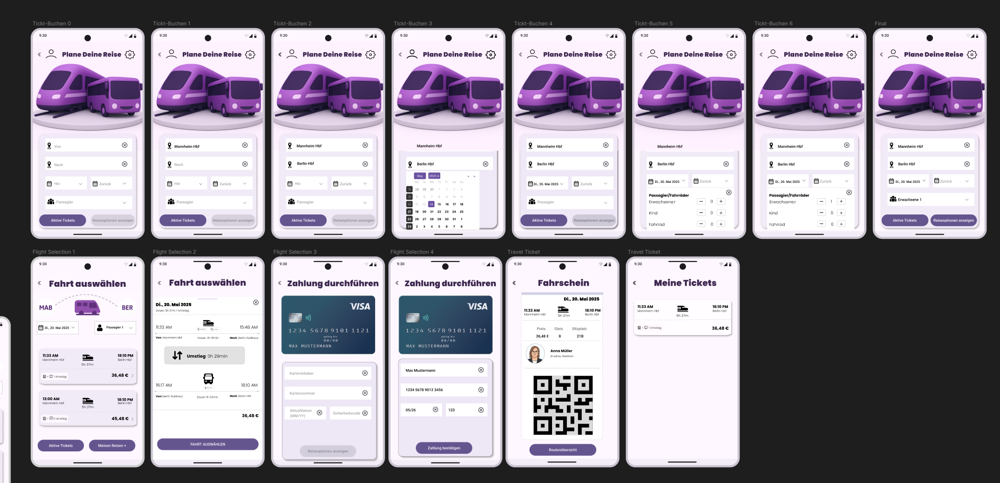

# 🎨 Urlaub Transport App - UI/UX Design

> Ein High-Fidelity Design-Prototyp für eine Reise- und Transport-App.

---

## 📱 Der Prototyp

Das Herzstück dieses Projekts ist der interaktive Prototyp in Figma. Er zeigt den vollständigen User-Flow von der Anmeldung bis zur Buchungsverwaltung.

### 🔗 [Hier klicken zum interaktiven Figma-Prototypen](https://www.figma.com/design/JxAbnqu8lpU2i3UCUJ3snO/SE2-Urlaub-Transport?node-id=0-1&t=auxPhwEYJEwG051q-1)

---

## 🖼️ Design Vorschau

Das Design folgt einem modernen, mobilen Ansatz ("Mobile First") mit klaren Strukturen und intuitiver Navigation.

### Screen Overview

  

---

## 🧩 Features & User Flow

Das Design deckt folgende Anwendungsfälle ab:

* **🔐 Authentifizierung:** Login-Screens, Registrierung und Passwort-Reset Flows.
* **⚙️ Einstellungen:** Detaillierte Profil- und App-Einstellungen (Benachrichtigungen, Privatsphäre).
* **🚆 Reise-Management:** Übersicht über geplante Reisen und Transportmittel.
* **📱 UI Komponenten:** Konsistente Nutzung von Buttons, Inputs und Cards durch Figma Components.

---

## 📂 Inhalt des Repositories

Da das eigentliche Design in der Cloud (Figma) liegt, enthält dieses Repository:

* 📄 **Projektdokumentation (PDF):** Detaillierte Beschreibung der Anforderungen und des Designprozesses.
* 📷 **Screenshots/Assets:** Exporte der wichtigsten Screens.

---

## 🛠 Tools

* **Figma:** Für Wireframing, UI-Design und Prototyping.
* **Design System:** Nutzung von Variablen und Styles für konsistente Farben und Typografie.

---

## 📝 Lizenz
Erstellt als Semesterprojekt im Modul Software Engineering 2 (SE2).
