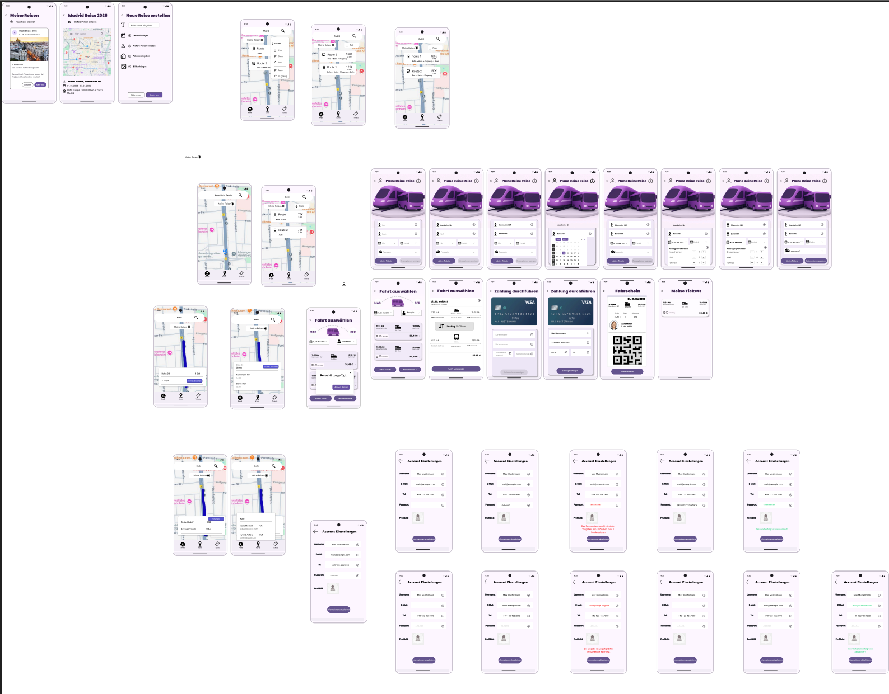

# Urlaub Transport App 🚖

Dies ist ein **eigenständig erstelltes Projekt**, das ich selbständig mit **Figma** konzipiert und umgesetzt habe.  
Es handelt sich **nicht um ein Uni-Projekt**, sondern um eine persönliche Arbeit, um meine Fähigkeiten in **UI/UX-Design** und **App-Konzeption** weiterzuentwickeln.

## Idee
Die App soll eine einfache Möglichkeit bieten, während einer Reise verschiedene Transportmittel (Taxi, Bus, Bahn) zu buchen und Fahrten zu verwalten.

## Features
- Buchung von Transportmitteln mit Start- und Zielort  
- Auswahl von Datum und Uhrzeit  
- Übersicht aller Buchungen mit QR-Code für Tickets  
- Nutzerfreundliches Interface mit modernem Design  

## Screenshot

## Prototype
👉 [Figma Prototyp ansehen](https://www.figma.com/design/JxAbnqu8lpU2i3UCUJ3snO/SE2-Urlaub-Transport?node-id=0-1)

## Technologien / Tools
- **Figma** (UI/UX Design, Prototyping)  
- Dokumentation und Versionierung über **GitHub**

---

✍️ Erstellt von mir – als persönliches Projekt, um meine Design- und Entwicklungskompetenzen auszubauen.
